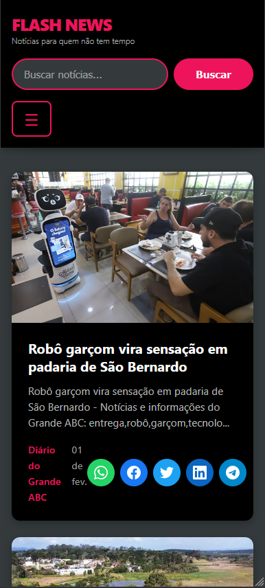
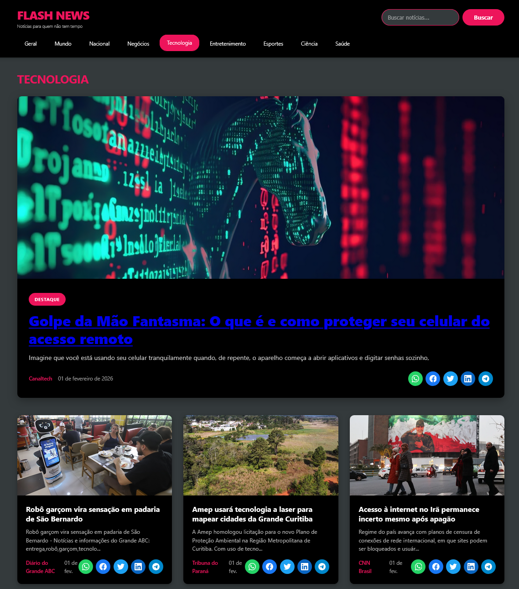

# Navegação
[< Anterior](08_Ferramentas_Geracao_Sites_Apps.md) | [Índice](../Aula%201.md) | [Próximo >](10_Pratica_Arquitetura.md)

---

## Prática: Criando um site de notícias

**Objetivo:** Criar um site de notícias em português que consuma a API GNews.

* **Requisitos básicos:**
  * Página inicial com notícias gerais
  * Campo de busca para pesquisar notícias
  * Menu de navegação com as categorias da API
  * Botões de compartilhamento em redes sociais para cada notícia
  * Design responsivo (funcionar bem em desktop e mobile)
* **Recursos fornecidos:**
  * Documentação da API: https://docs.gnews.io/
  * API Key: Cadastre-se para ter 100 requisições gratuitas por dia.
  * Exemplo de chamada: https://gnews.io/api/v4/top-headlines?category=general&lang=pt&country=br&apikey=SUA_API_KEY
* **Dicas:**
  * Lembre-se das técnicas de prompt.
  * Você também pode usar a própria IA para melhorar seu prompt.
  * Utilize um dos chats vistos.
* **Exemplo de resultado final:**

---

# Navegação
[< Anterior](08_Ferramentas_Geracao_Sites_Apps.md) | [Índice](../Aula%201.md) | [Próximo >](10_Pratica_Arquitetura.md)
